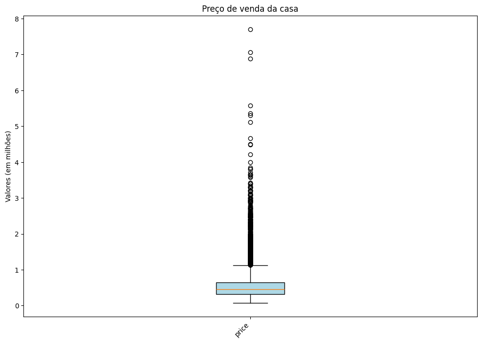
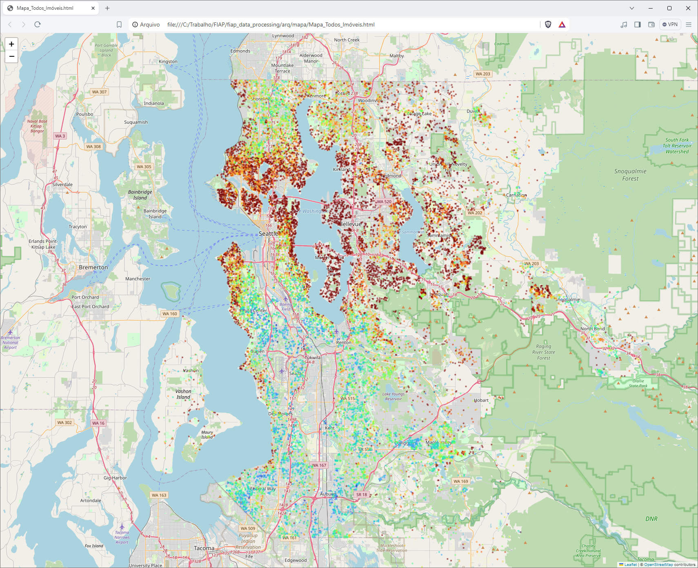
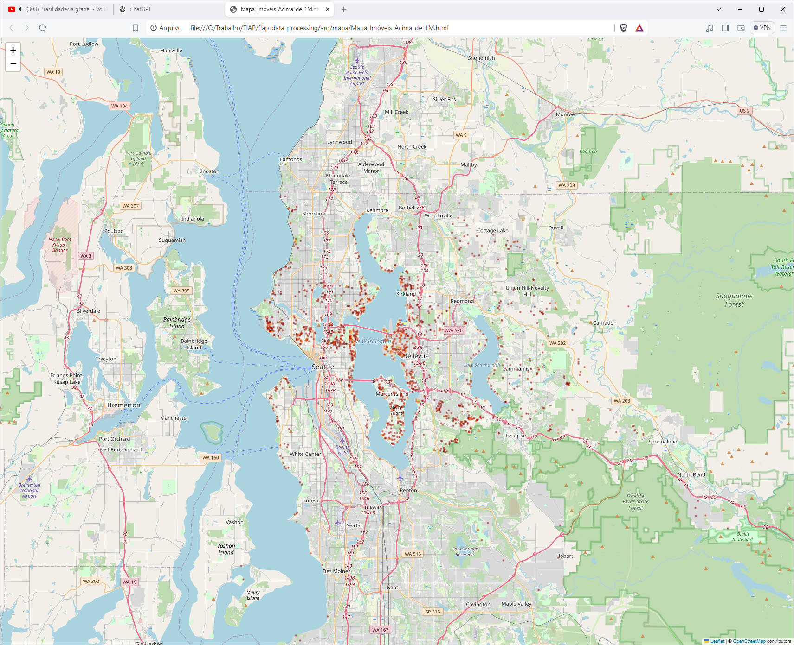

# Data Processing with Python
### Trabalho Integrado

### Índice 
1. [Descrição Projeto](#descrição-projeto)
    - [Introdução](#introdução)
    - [Objetivo](#objetivo)
    - [Seu Trabalho é](#seu-trabalho-é)
    - [Entregáveis](#entregáveis)
    - [Dataset](#dataset)
2. [EDA - Analise Exploratória](#eda---análise-exploratório)
    - [Distribuição dos Dados](#distribuição-dos-dados)
    - [Mapa dos Imóveis](#localização-dos-imóveis)
3. [Uso do Projeto](#uso-do-projeto)
# Descrição Projeto
## Introdução

O departamento de crédito da QuantumFinance solicitou a criação de um algoritmo para prever o preço de venda de suas casas com
base em várias características. Eles coletaram dados de vendas recentes, incluindo informações como o tamanho da casa (em pés
quadrados), o número de quartos, o número de banheiros, a idade da casa (em anos) e a proximidade com o centro da cidade (em
quilômetros).  

## Objetivo
O objetivo é desenvolver um modelo de Regressão Linear Multivariada que preveja o preço de venda das casas com base nessas
características. Para isso, você recebeu um conjunto de dados contendo informações de venda de várias casas, incluindo o preço de
venda e as características mencionadas anteriormente.

## Seu trabalho é:
- Explorar e analisar os dados para entender a distribuição das características e a relação com o preço de venda.
- Dividir o conjunto de dados em conjuntos de treinamento e teste.
- Desenvolver um modelo de Regressão Linear Multivariada utilizando as características como variáveis independentes e o preço de venda como variável dependente.
- Avaliar o desempenho do modelo usando métricas como o RMSE abaixo de 69000.
- Fazer previsões do preço de venda para novas casas com base nas características fornecidas.

## Entregáveis:
- Jupyter Notebook: O notebook deverá estar bem organizado com seções claras e textos que facilitem a compreensão da análise e decisões tomadas e que permita
a obtenção do resultado final a partir do dataset disponibilizado.

## Dataset:
- [house_prices]('arq\house_prices.csv')

# EDA - Análise Exploratório 

## Indentificação das colunas 
Tabela com as colunas do arquivo `house_prices.csv` e a descrição do que cada coluna representa:

| Coluna          | Descrição                                                                 |
|-----------------|--------------------------------------------------------------------------|
| `id`            | Identificação única da casa                                              |
| `date`          | Data da venda da casa                                                    |
| `price`         | Preço de venda da casa                                                   |
| `bedrooms`      | Número de quartos na casa                                                |
| `bathrooms`     | Número de banheiros na casa                                              |
| `sqft_living`   | Área útil da casa em pés quadrados                                       |
| `sqft_lot`      | Tamanho do lote em pés quadrados                                         |
| `floors`        | Número de andares na casa                                                |
| `waterfront`    | Indicador se a casa tem vista para a água (0 = não, 1 = sim)             |
| `view`          | Índice de qualidade da vista (0-4)                                       |
| `condition`     | Índice de condição da casa (1-5)                                         |
| `grade`         | Índice de qualidade de construção e design da casa (1-13)                |
| `sqft_above`    | Área útil acima do solo em pés quadrados                                 |
| `sqft_basement` | Área útil no porão em pés quadrados                                      |
| `yr_built`      | Ano de construção da casa                                                |
| `yr_renovated`  | Ano de renovação da casa                                                 |
| `zipcode`       | Código postal da localização da casa                                     |
| `lat`           | Latitude da localização da casa                                          |
| `long`          | Longitude da localização da casa                                         |
| `sqft_living15` | Área útil das casas vizinhas em pés quadrados (média dos últimos 15 anos)|
| `sqft_lot15`    | Tamanho do lote das casas vizinhas em pés quadrados (média dos últimos 15 anos)|

## Distribuição dos dados
Análisando a distribuição dos dados oque mais destaca na análise e a coluna price, aqual possue bastante valores outliers, sendo uma coluna que precisa de um reflexão em como utilizar os dados para o modelo.

## Localização dos imóveis
Primeiro é análisado a localização de todas as casas, alterando a cor de cada imóvel com base numa escala onde a cor azul é o menor valor do imóvel e vermelhor é o valor do imóvel que se encontra no quartil 75%, essa escala está dessa forma por causa dos outiers. 

E para enxergar melhor os outliers foram separados os imóveis que tem um preço acima de 1M. 

# Uso do projeto

1- Clone esse repositório  
`git clone git@github.com:rodrigoro86/fiap_DataModeling_av1.git`

2- Crie um ambiente virtual para isolar as bibliotecas de outros projetos  
`python -m venv venv`

3- Ative o ambiente virtual  
Windows
`.\venv\Scripts\activate`

4 - Instale as depêndencias   
`pip install -r requirements`

5- Pronto agora é só rodar o cadernos, lembre que precisa do pluglin Jupyter no VSCode !!!